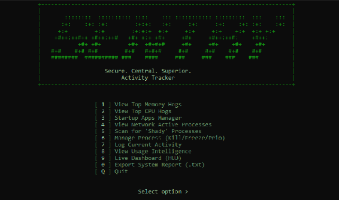

# Sentry: Advanced Process Monitoring & System Activity Tracker

**Sentry** is a high-performance Command-Line Interface (CLI) utility designed for power users, system administrators, and developers. Built entirely within the PowerShell environment, it bridges the gap between standard monitoring tools (like Task Manager) and kernel-level system manipulation.

Sentry provides granular control over running applications, including the ability to suspend execution threads, latch processes to specific CPU cores, and surgically remove startup applications from the Windows Registry.

<p align="center">

</p>

---

## Overview

Modern operating systems often prioritize safety and user-friendliness over granular control. When a system is under heavy load or an application becomes unresponsive, graphical interfaces can be slow to launch. Sentry leverages the speed of the command console and the power of the .NET framework to provide an instant, lightweight dashboard for system management.

Unlike standard tools, Sentry allows for "God Mode" capabilities, utilizing C# method injection to access Windows API calls not natively exposed in PowerShell.

## Key Features

### 1. Deep Process Control

Beyond simple termination, Sentry offers advanced management for running tasks:

* **Tree Kill:** Forcefully terminates a parent process and all child sub-processes (e.g., closing all browser tabs instantly).
* **Freeze / Resume:** Uses `ntdll.dll` to suspend process threads in memory, allowing users to pause resource-heavy applications without closing them.
* **CPU Affinity:** Latch specific processes to physical CPU cores.
* **Priority Management:** Dynamically adjust process priority classes (Idle, Normal, High, RealTime).

### 2. Startup Optimization

* **BIOS Boot Analysis:** Retrieves the exact "Last BIOS Boot Time" (in seconds) from the Windows Event Log.
* **Registry Management:** Scans `HKCU` and `HKLM` run keys and allows for the permanent deletion of startup entries to reduce boot latency.

### 3. Security & Heuristics

* **Shady Process Scanner:** Uses behavioral heuristics to flag potentially malicious processes based on unsigned code, suspicious file paths (AppData/Temp), and hidden window states.
* **Network Sentinel:** Filters active TCP/UDP connections to identify applications establishing external communication.

### 4. Intelligence & Logging

* **Activity Logger:** Snapshots active processes to a local JSON database.
* **Usage Intelligence:** Calculates average session durations and identifies the most frequently used applications over time.
* **Live Dashboard:** A secondary "Heads-Up Display" for real-time monitoring on separate screens.

---

## System Requirements

* **Operating System:** Windows 10 or Windows 11 (64-bit).
* **Environment:** Windows PowerShell 5.1 or PowerShell Core 7+.
* **Permissions:** Administrative privileges are **mandatory** for Registry access and process suspension.

## Installation

Sentry is a portable, single-file application; no installation wizard is required.

1. **Download:** Download the `Sentry.ps1` file to a local directory.
2. **Unblock File:** Windows may block scripts downloaded from the internet. Run the following command in PowerShell:
```powershell
Unblock-File -Path .\Sentry.ps1

```


3. **Execution Policy:** Ensure your system allows script execution. Run PowerShell as Administrator and execute:
```powershell
Set-ExecutionPolicy -ExecutionPolicy RemoteSigned -Scope CurrentUser

```


---

## Usage Guide

To launch the application, open PowerShell as **Administrator** and run:

```powershell
.\Sentry.ps1

```

### Main Menu

The dashboard is navigable using numeric keys `0-9`:

* **[ 1 ] View Top Memory Hogs:** Displays top 30 processes sorted by Working Set (RAM).
* **[ 2 ] View Top CPU Hogs:** Displays top 30 processes sorted by Processor Time.
* **[ 3 ] Startup Apps Manager:** Manage boot applications and registry keys.
* **[ 4 ] Active Traffic Scanner:** View established network connections.
* **[ 5 ] Shady Process Scanner:** Run security heuristics.
* **[ 6 ] Manage Process:** Access the deep control sub-menu.
* **[ 7-9 ] Logging & HUD:** Access historical data and real-time dashboards.
* **[ 0 ] Export Report:** Generate a system status text file.

### Deep Process Control (Option 6)

This module allows for aggressive process management:

1. **Select View Mode:** Choose between "Safe Mode" (User apps only) or "God Mode" (All system processes).
2. **Select Target:** Enter the Process ID (PID) or the Application Name.
3. **Execute Action:** Perform a Kill (Tree Kill), Freeze (`NtSuspendProcess`), or set CPU Affinity.

---

## Technical Architecture

Sentry utilizes a hybrid architecture combining PowerShell scripting with .NET Framework integration.

* **P/Invoke (Platform Invocation):** To achieve functionality not natively available in PowerShell cmdlets, Sentry compiles C# code at runtime using `Add-Type` to access `ntdll.dll`.
* **Data Persistence:** Activity logs are stored in standard JSON format (`sentry_activity_log.json`) and automatically trim to the most recent 5,000 entries.
* **Visual Rendering:** The UI relies on ANSI escape codes and ASCII block characters for high-contrast rendering in the terminal.

---

## Disclaimer

**Use with caution.** Sentry provides administrative access to critical system functions.

* **Process Termination:** Forcing the termination of system-critical processes (e.g., `csrss.exe`) will result in a Blue Screen of Death (BSOD) and immediate system restart.
* **Registry Editing:** The Startup Manager permanently deletes registry keys; this action cannot be undone via the tool.

The authors and contributors are not responsible for any data loss, system instability, or hardware damage resulting from the misuse of this tool.

---

## License

This project is open-source and available for modification and distribution. Refer to the `LICENSE` file in the repository for specific terms.

Would you like me to create a separate file specifically for the **Technical Architecture** diagrams or more detailed developer documentation?
